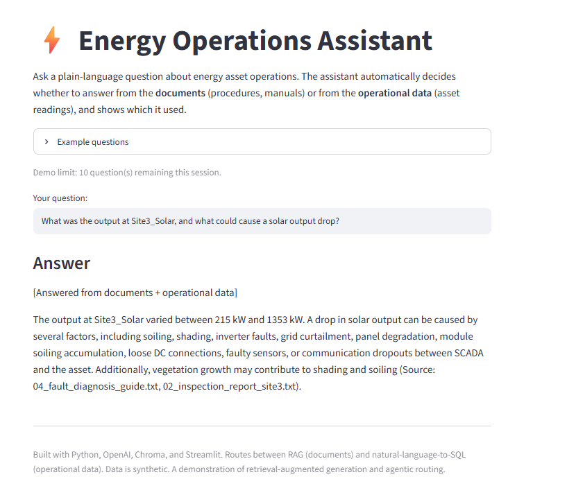

# ⚡ Energy Operations Assistant (RAG)

**🔗 Live demo:** https://anuri-energy-rag.streamlit.app/


## Demo
   
   

A Retrieval-Augmented Generation (RAG) assistant that answers plain-language questions about energy asset operations. Answers are grounded in a document knowledge base and cite their source, so responses are traceable rather than invented.

Built on synthetic data covering both wind and solar assets, demonstrating a pattern applicable across renewable energy and broader energy operations.

## What it does

Ask a question like *"At what gearbox oil temperature must a turbine be shut down?"* and the system:

1. Converts the question into an embedding (a vector representing its meaning)
2. Retrieves the most relevant document chunks from a vector database by semantic similarity
3. Passes those chunks to an LLM with strict grounding instructions
4. Returns an answer **based only on the retrieved documents, with the source cited**

If the answer isn't in the knowledge base, it says so rather than guessing — the core of hallucination mitigation.

## Architecture

```
Documents ──► chunk ──► embed ──► Vector store (Chroma)
                                        │
Question ──► embed ──► similarity search ┘──► relevant chunks
                                        │
                          grounded prompt + LLM ──► cited answer
```

## Tech stack

- **Python**
- **OpenAI** — `text-embedding-3-small` (retrieval) + `gpt-4o-mini` (generation)
- **Chroma** — local vector database
- **Streamlit** — interactive demo interface

## How RAG is implemented

- **Chunking:** documents split into overlapping ~500-character chunks for precise retrieval
- **Embeddings:** semantic vectors so retrieval matches by *meaning*, not keywords
- **Grounding:** the system prompt restricts answers to retrieved context, requires source citation, and instructs the model to admit when information is missing; `temperature=0` for factual consistency

## Running locally

```bash
python -m venv venv
venv\Scripts\activate          # Windows (macOS/Linux: source venv/bin/activate)
pip install -r requirements.txt

# add your OpenAI key to a .env file:
# OPENAI_API_KEY=sk-...

python ingest.py               # index the documents (run once)
streamlit run app.py           # launch the demo
```

## Data

All data in `data/` is **synthetic** and created for demonstration. It contains no proprietary or confidential information.

## Notes

This project was built independently as a demonstration of RAG fundamentals — embeddings, semantic retrieval, grounding, and source attribution — using publicly known techniques.
